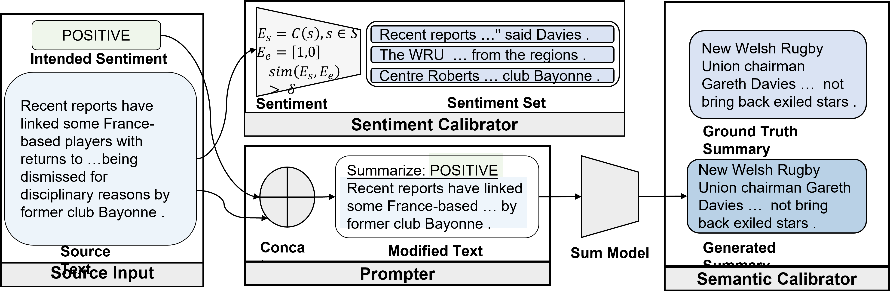

 # Desentiment: Controlling Sentimental Tendency During Summary Generation 

## Method Overview 

Desentiment introduces a **Sentimental-Supervised Summarization Task (S3T)** framework that enables the generation of abstractive summaries with controllable sentiment. The method integrates sentiment control into the summarization process through three key components: 

1. **Sentiment Prompter**: Injects sentiment-aware prompts into the input to guide the model toward the desired emotional tone. 
2.  **Summary Calibrator**: Generates the summary based on the prompt-augmented input using a Transformer-based architecture. 
3.  **Sentiment Calibrator**: Ensures the output aligns with the target sentiment by comparing it against selected sentences from the source text. The training objective combines both **semantic fidelity** and **sentiment accuracy**, balancing them via a weighted loss function. --- ## Results We evaluated Desentiment on two benchmark datasets: **CNN/DM** and **XSum**, using ROUGE and sentiment metrics (T-1 to T-4). Our model outperforms previous approaches in sentiment control while maintaining competitive summarization quality. 

### Performance 

| System             | R-1   | R-2   | R-L   | T-1   | T-2      | T-3      | T-4    |
|--------------------|-------|-------|-------|-------|----------|----------|--------|
| **CNN/DM**          |        |
| BART               | 44.16 | 21.28 | 40.90 | 38.46 | -31.21   | -29.71   | 16.50  |
| BRIO-ctr           | **47.28** | **22.93** | **44.15** | 38.84 | -29.95   | -29.58   | 17.52  |
| **Desentiment (Ours)** | 44.42 | 21.13 | 41.47 | **40.41** | **-28.18** | **-28.74** | **19.33** |
|                    |       |       |       |       |          |          |        |
| **XSum**                 |
| PEGASUS            | 47.46 | 24.69 | 39.53 | 48.51 | -15.61   | -30.02   | 1.13   |
| BRIO-ctr           | **48.13** | **25.13** | **39.84** | 47.72 | -14.48   | -29.84   | 1.63   |
| **Desentiment (Ours)** | 47.10 | 24.73 | 39.37 | **46.79** | **-10.40** | **-29.51** | **3.87** |

> `*`: Indicates significant improvement over all baselines (p < 0.01).  
> `R-*`: ROUGE scores for factual correctness.  
> `T-*`: Sentiment transfer strength; lower negative values indicate stronger negative sentiment, higher positive values indicate stronger positive sentiment.
>

## Illustration

*Overview of the Desentiment framework. The model uses sentiment prompts and dual calibration modules to generate sentiment-controlled summaries.*

## CopyRight
This repository is modified from [BRIO](https://github.com/yixinL7/BRIO) project. 
I added the sentiment and semantic taggers to `./Tagger/`, and added the  sentiment calibrator to `./model.py` change loss function in `./main.py` to balance the sentiment and semantics.